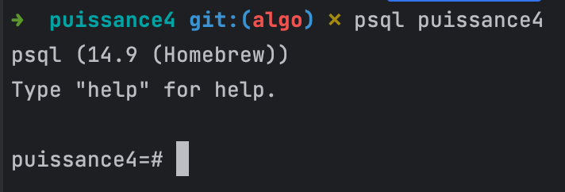

## Table des matières

1. [Notre mise en place](#Notre-mise-en-place)
2. [Middleware HATEOAS](#middleware-hateos)
3. [Middleware de traduction avec i18next](#middleware-de-traduction-i18next)
4. [Middleware de route Game pour notre base de données](#middleware-de-route-Game)
4. [Middleware de route Partie pour notre base de données](#middleware-de-route-Partie)
5. [Inscription et connexion utilisateur](#inscription-et-connexion-utilisateur)


## Notre mise en place
<a name="Notre-mise-en-place"></a>

### gérer les variables d'environnement
la doc de dotenv : https://github.com/motdotla/dotenv#readme

### pour notre base de données
On a créé une base de données SQL grâce à Sequelize : https://sequelize.org/. 
Et postgres https://www.postgresql.org/ avec psql. Attention si vous téléchargez postgres avec homebrew (la version 14.9, la dernière) il peut avoir un problème d'emplacement : https://www.postgresql.org/docs/16/tutorial-createdb.html (si pb aide -> sur le terminal de mac chercher which postgres). 

#### installer postgres sur son mac
Dans terminal, écrivez "createdb puissanec4" (on installe la database puissance4), puis sortir de là. Et sur nouveau terminal tapez "psql puissance4", si on peut rentrer dedans, c'est cool ca marche si on voit :



On peut lancer le serveur : npm run watch maintenant et aller dans la / (home) pour voir toutes nos routes grâce à HATEOAS.


## Explication de nos middlewares

### middleware hateos
<a name="middleware-hateos"></a>

HATEOAS retourne quand on fait un appel HTTPS sur Insomnia ou Postman :
```
{
	"routes": [
		"/route1",
		"/route2"
	],
	"links": [
		{
			"href": "/route1",
			"links": [
				{
					"href": "/route1",
					"rel": "self",
					"method": "GET",
					"title": "title de la route 1"
				}
			]
		},
		{
			"href": "/route2",
			"links": [
				{
					"href": "/route2",
					"rel": "self",
					"method": "DELETE",
					"title": "title de la route 2"
				}
			]
		}
	]
}
```

On reçoit en premier toutes les routes que comprend notre API, d'abord le lien de la route sur lequel on a lancé la requête HTTP, puis les autres routes de notre application. Plus bas, on a le détail de chaque route avec leurs links utilisés. Voir la prochaine section pour comprendre le contenu de nos links.

#### Pour ajouter un link dans une route
Aller dans le middleware HATEOAS et ajouter un lien dans la fonction 'linksByRoute' comme ceci :
```
linksByRoute.set('/myroute, [
    {href: '/myroute', rel: 'self', method: 'GET', title: 'myroute'},
]);
```

- href : l'url de la route
- rel : le nom de la route
- method : la méthode de la route (POST, GET, PUT, DELETE)
- title : le nom de la route

### middleware de traduction (i18next)
<a name="middleware-de-traduction-i18next"></a>

i18n retourne la traduction dans la bonne langue : gère un site multilingue (en français et en anglais pour nous, mais on pourrait rajouter n’importe quelle langue et ça fonctionnerait).

Dans l’objet request :
Le middleware recherche la langue du navigateur de l’utilisateur et retrouve la langue ('fr' pour français, 'en' pour l’anglais) en en-tête du navigateur ou si la langue n’est pas définie par le navigateur ou notre site n’arrive pas à récupérer la langue renvoie la traduction en français (qui est la langue par défaut définie).
À savoir qu’une fois que le middleware connaît la langue, il redirige vers le json adapté. On a créé un dossier 'traductions', dans lequel il y a un dossier pour chaque route distincte de notre application (nommé par le nom de sa route), et dans chaque page il y a deux fichiers, un fichier en 'fr.json' et un fichier en 'en.json' qui donnent respectivement la clé<->valeur de la traduction.
Nota bene : tous nos fichiers json des différentes langues associées à une page ont la même clé. On a fait ça pour simplifier le processus. La clé de traduction est toujours la même. On change juste de fichier pour récupérer la valeur associée en fonction de la demande (rediriger vers le bon json en fonction de sa route).


#### Pour utiliser une traduction i18n dans notre code :
1. L’importer dans notre fichier app.js (à faire seulement une fois) et l’initialiser.
2. On peut désormais utiliser la fonction res.locals.t() pour appeler la clé qui va nous retourner la valeur associée (notre traduction souhaitée).

Exemple concret :
```
// Étape 1
import { i18n } from './middlewares/i18n.js';
app.use(i18n);
// Étape 2
const messageTraduit = res.locals.t('Bienvenue'); //clé: bienvenue va donner la valeur associée
res.json({
routes: req.routes,
links: req.links
});
```

### middleware de route Game
<a name="middleware-de-route-Game"></a>

// a compléter


### middleware de route Partie
<a name="middleware-de-route-Partie"></a>

// a compléter


### Inscription et connexion utilisateur
Evidemment il faut allumer le serveur pour que ça marche.

### inscription 
Tout se fait sur une application pour tester une API comme Postman ou Insomnia. en POST chercher cette route http://localhost:3000/inscription et incorporer un json dans la requête : {
"firstName": "A remplir",
"lastName": "A remplir",
"email": "A remplir",
"password": "A remplir"
}

Puis envoyer la requête et vous allez obtenir un statut 200.

### Connexion
Pour la connexion pour savoir ce que vous pouvez prendre comment firstName et Password en get vous pouvez chercher d'abors en get sur Postman http://localhost:3000/utilisateurs, cela vous retournera un fichier jsopn avec tout les utilisateurs sur notre BDD. Ouvrez en parallèle un autre onglet postman et tapez http://localhost:3000/connexion en POST et mettre en json en requête : {
"firstName": "A remplir",
"password": "A remplir"
}

Si vous avez bien mit un firstName et un mot de passe qui existe dans la BDD, vous allez obtenir un statut retour 200 et un json {
"message": "ca marche"
}.